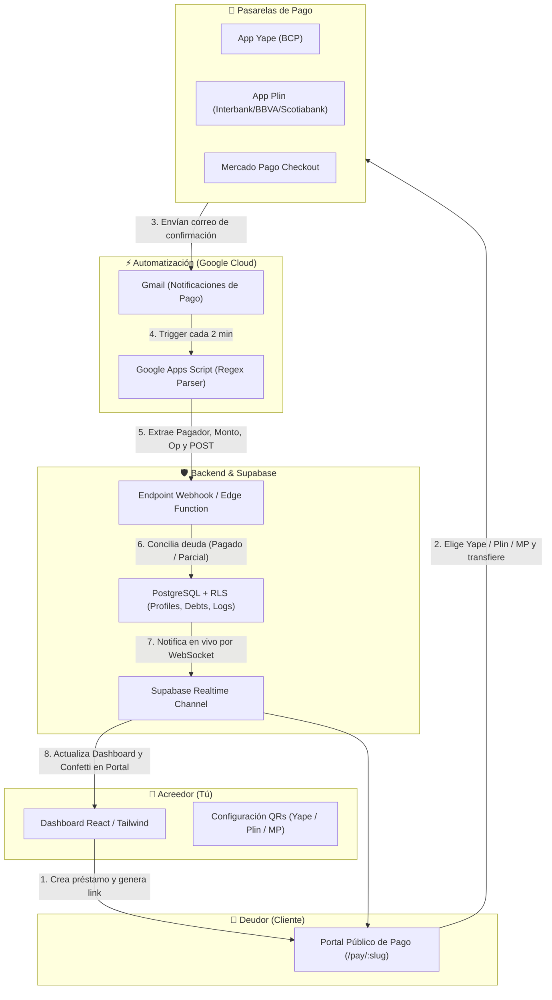

# 🐷 MarranilloPay: Plataforma de Control de Préstamos y Conciliación Automática

Sistema integral de gestión de deudas, cobros multi-pasarela (Yape, Plin y Mercado Pago) y conciliación automática en tiempo real mediante **Google Apps Script**, **Supabase** y **React + Tailwind CSS**.

---

## 🏗️ 1. Arquitectura del Sistema



---

## 📁 2. Estructura del Proyecto

```text
PlataformaPagos/
├── database/
│   ├── schema.sql                 # Esquema PostgreSQL con RLS, triggers e índices
│   └── seed.sql                   # Datos de prueba de ejemplo
├── backend/
│   ├── server.js                  # Servidor Express.js con motor de conciliación y matching
│   ├── package.json               # Dependencias del servidor Node.js
│   ├── .env.example               # Variables de entorno requeridas
│   └── supabase/functions/
│       └── webhook-payment/       # Alternativa Serverless: Supabase Edge Function (Deno)
├── frontend/
│   ├── src/
│   │   ├── components/            # Tarjetas, modales de creación, detalle y ajustes
│   │   ├── pages/                 # Dashboard, Portal Público de Pago y Auth
│   │   ├── context/               # AuthContext con gestión de sesión y perfiles
│   │   ├── lib/                   # Cliente Supabase y formateadores
│   │   └── types/                 # Interfaces TypeScript
│   ├── package.json
│   ├── vite.config.ts
│   └── tailwind.config.js
└── automation/
    ├── google-apps-script.js      # Script de Gmail con Regex para Yape, Plin y Mercado Pago
    └── README-GAS.md              # Guía paso a paso para desplegar en Google Apps Script
```

---

## 🚀 3. Guía de Instalación y Despliegue

### Paso 1: Configurar la Base de Datos (Supabase)
1. Crea un proyecto gratuito en [Supabase](https://supabase.com).
2. Ve al **SQL Editor** en el panel lateral de Supabase.
3. Abre el archivo [`database/schema.sql`](./database/schema.sql), copia todo su contenido y ejecútalo.
4. Esto creará:
   - Tabla `profiles`: Guarda tus números y QRs de Yape/Plin aislados por usuario.
   - Tabla `debts`: Préstamos con estados (`PENDIENTE`, `PAGO_PARCIAL`, `PAGADO`).
   - Tabla `payment_logs`: Registro histórico de todas las transferencias detectadas.
   - Políticas RLS: Seguridad estricta a nivel de fila (el Usuario A jamás puede ver datos del Usuario B).
   - Función RPC `get_public_debt_details`: Permite al portal público de pago consultar los datos del deudor de forma segura.

---

### Paso 2: Iniciar el Backend (Webhook)
Puedes elegir entre ejecutar el servidor **Node.js/Express** o desplegar la **Supabase Edge Function**.

#### Opción A: Servidor Express (Node.js)
```bash
cd backend
npm install
cp .env.example .env
```
Edita `.env` con tus claves de Supabase:
- `SUPABASE_URL`: Tu URL del proyecto Supabase.
- `SUPABASE_SERVICE_ROLE_KEY`: Clave secreta administrativa de Supabase (Settings > API > `service_role`).
- `WEBHOOK_SECRET_KEY`: Una contraseña segura para autenticar a Google Apps Script.

Inicia el servidor:
```bash
npm run dev
```

#### Opción B: Supabase Edge Function (100% Serverless)
Si no deseas tener un servidor Node.js encendido:
```bash
cd backend
supabase functions deploy webhook-payment --no-verify-jwt
supabase secrets set WEBHOOK_SECRET_KEY=tu_clave_secreta_super_segura
```

---

### Paso 3: Configurar Google Apps Script (Gmail Bot)
1. Ve a [script.google.com](https://script.google.com/) con la cuenta de Gmail donde recibes las alertas bancarias.
2. Crea un proyecto y pega el código de [`automation/google-apps-script.js`](./automation/google-apps-script.js).
3. En la constante `CONFIG`:
   - Coloca la URL de tu endpoint: `https://tu-dominio.com/api/webhook/payment` (o tu Supabase Edge Function URL).
   - Coloca la misma `WEBHOOK_SECRET` que definiste en el backend.
4. Ejecuta la función `setupAutomatedTrigger` una sola vez para que revise automáticamente tu correo cada 2 minutos.

---

### Paso 4: Iniciar el Frontend (React + Vite)
```bash
cd frontend
npm install
cp .env.example .env
```
Configura tu archivo `frontend/.env`:
```env
VITE_SUPABASE_URL=https://tu-proyecto.supabase.co
VITE_SUPABASE_ANON_KEY=tu_supabase_anon_public_key
```
Inicia la aplicación:
```bash
npm run dev
```
La aplicación abrirá en `http://localhost:3000`.

---

## 🧪 4. Simulación de Pruebas de Conciliación

Puedes probar el webhook enviando un payload de prueba vía `curl` o Postman sin esperar un correo real:

```bash
curl -X POST http://localhost:4000/api/webhook/payment \
  -H "Content-Type: application/json" \
  -H "x-webhook-secret: tu_clave_secreta_super_segura_12345" \
  -d '{
    "source": "YAPE",
    "payer_name": "Juan Carlos Perez",
    "amount": 150.00,
    "operation_number": "OP-98765432",
    "concept": "Pago de deuda",
    "recipient_email": "tu-email-de-usuario@correo.com"
  }'
```

**Resultado esperado:**
- Si la deuda era de S/ 150.00: El estado cambia inmediatamente a **`PAGADO`** y la tarjeta se traslada a la pestaña *Historial Pagados*.
- Si la deuda era de S/ 200.00: El estado cambia a **`PAGO_PARCIAL`**, el saldo se actualiza a S/ 50.00 y se muestra la barra de progreso.
- Si el portal público del deudor (`/pay/:slug`) estaba abierto, se activa la animación de confeti en tiempo real.
